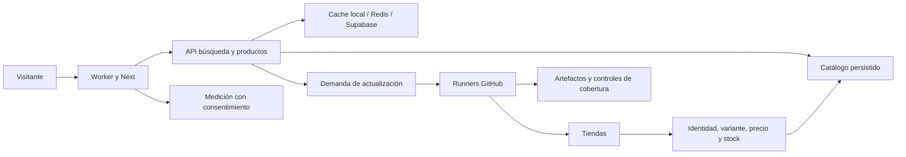

# Dirección de Comparador Hardware Argentina

**Objetivo de 90 días: que usuarios reales encuentren ofertas fiables y vuelvan.** Jonathan confirmó el 06/10/2026 que comparar un componente y armar una PC tienen igual prioridad, y que dispone de más de diez horas semanales. Estas decisiones ordenan el trabajo técnico y el crecimiento.

Este documento es el punto de entrada para decisiones y prioridades. Los reportes anteriores conservan su evidencia y sus fechas; una respuesta vieja de un chat no sustituye el estado actual. La auditoría de esta sesión es una línea base amplia, no una certificación exhaustiva de cada archivo, comercio, combinación de PC ni cuenta externa.

La última dirección de Jonathan del 06/10 es coordinar desde este chat mediante subagentes especializados con GPT-6.1 Sol y razonamiento alto. Se prepararon siete perfiles del proyecto. El procedimiento y el límite de activación actual están en [ORQUESTACION.md](ORQUESTACION.md).

**Estado vigente del 07/10:** `99d5917` publicado y comprobado en el sitio; contiene confianza, diagnóstico y lectores de las 36 fuentes, más la corrección del ícono. El piloto separado de caché terminó: exactamente 1000 eventos vencidos, cuatro commits de 250, sin disminución física medida. Jonathan fijó **costo cero y límites de alcance**. La candidata local `codex/retencion-comprobable` contiene el wrapper `0ba14fc` y la propuesta aislada `eac9b6a`, con once grupos de pruebas y revisión independiente. La lectura productiva de las 15:59:47 UTC encontró 36 candidatas en una ventana de 1000; no estima el total ni demuestra recuperación física. No se borró historial ni se publicó esa candidata. D02/G02 continúan abiertos por cobertura, continuidad y capacidad. [Estado y evidencia vigente](/Users/johnortiz/.codex/worktrees/comparador-confianza/comparador-hardware-argentina/docs/reports/retencion-aislada-2026-10-07/README.md).

**Corte automático 16:11 UTC / 13:11 Santiago:** el evento de la versión publicada completó sin excepciones, con resultado `deferred` por límite de frecuencia. No despachó refresh desde ese evento. GitHub posterior agotó dos lecturas: no hay ciclo nuevo completo acreditado. La inspección de tres índices tampoco cierra capacidad: incluso descontando los tres y toda la caché hipotéticamente quedan 643.468.435 bytes. Se conserva “Bajaron de precio” y los índices históricos no equivalentes; retirar el duplicado de 1,4 MB es mantenimiento secundario.

## Cómo ayudamos a decidir

Jonathan pidió expresamente que dirección lo ayude a decidir y cuestione sus propuestas cuando otra opción resulte más viable. El coordinador recomienda con criterio propio y explica sus desacuerdos; Jonathan conserva la decisión final. Las decisiones confirmadas se respetan, y se propone revisarlas cuando los argumentos o la evidencia lo justifiquen.

Antes de comprometer capacidad en una decisión relevante:

1. Precisar qué problema resuelve y qué supuesto sostiene la propuesta.
2. Contrastar hechos, hipótesis e incertidumbres con el objetivo de utilidad y retorno.
3. Comparar alternativas concretas, incluyendo posponer si su costo de oportunidad lo justifica.
4. Recomendar una opción por impacto, esfuerzo, costo, riesgo y facilidad de corregir el rumbo; explicar qué se deja de hacer al elegirla.
5. Definir la prueba más pequeña útil y el resultado que haría mantener, cambiar o abandonar la decisión.

La recomendación debe ser explícita. La falta de datos se registra y se investiga proporcionalmente; no se inventa certeza ni se reabre cada decisión rutinaria. Los especialistas aportan evidencia de su dominio y señalan conflictos de prioridad; dirección evalúa el resultado para el proyecto completo.

## Qué hacer primero

1. **Medir la recuperación con la versión publicada.** Correlacionar un ciclo natural y sus observaciones guardadas/comparables; conservar muestra, denominadores y condiciones G02.
2. **Recuperar fuentes y resolver capacidad con costo cero.** Priorizar causas de la matriz por demanda y utilidad. Retención aislada preparada y lectura productiva acotada comprobada; capacidad aún no resuelta. Posponer ampliaciones que añadan almacenamiento, conservando ambos recorridos y la muestra/95% de G02. El piloto de 1000 eventos alcanzó su máximo; cualquier borrado adicional, índice o recuperación física requiere una operación distinta, concreta y autorizada.
3. **Demostrar utilidad y retorno en ambos recorridos.** Comparación, selección de siete piezas, presupuesto, compatibilidad, errores y recuperación; después medir usuarios externos que vuelven.

Máximo tres entregas en ejecución. Ingeniería, catálogo, producto, performance y medición son responsables distintos, pero colaboran sobre esas entregas. Tener un chat no autoriza a abrir otro proyecto dentro del proyecto.

### Primer encargo recomendado, revalidado el 06/10

La conciliación de los borradores antiguos ya está guardada en main, commit 6c8dba3, informe docs/reports/CONCILIACION-CAMBIOS-2026-10-06.md. No repetirla como otra auditoría. El fetch de esta revisión confirma origin/main f899ced. La entrega de producto avanzó a 37c354a y está limpia, con quince commits propios y 67 remotos pendientes; 31 archivos cambiaron en ambos lados.

La primera entrega es **confianza en las ofertas sobre una candidata actual**. Ingeniería adapta únicamente los cambios necesarios de precio destacado/orden, publicación/regreso y exclusión de notebooks abreviadas. Usa los lectores, identidad, caché y Worker vigentes. Conserva la ampliación de fichas/benchmarks para una unidad posterior; no importa ramas o archivos enteros que retiren reparaciones recientes. La entrada antigua src/worker.ts, caché local v3 y lector exclusivo de CPU no deben sustituir custom-worker.mjs, caché v5 ni el lector canónico actual de main.

En paralelo se abrió la investigación de REFRESH_CLAIM_FAILED del 06/10: el artefacto registra el fallo y 598 observaciones, pero el código perdía el detalle del error RPC. La segunda entrega descrita abajo identifica la llamada por inferencia y conserva el diagnóstico para nuevos incidentes; la causa original del servidor sigue sin estar retenida. No asumir que aumentar concurrencia o agregar reintentos resuelve el problema.

Cerrar la candidata exige pruebas enfocadas, build OpenNext y navegador escritorio/móvil: destacado y lista usan la misma oferta elegible; las referencias antiguas quedan fuera del mínimo reciente; el vencimiento conserva la fecha; abrir/regresar conserva publicación y variante; comparación y armador mantienen su funcionamiento. La matriz de 150 ejecuciones de la rama completa no se traslada automáticamente a esta candidata reducida. La recuperación de cobertura requiere su propia evidencia y conserva las metas existentes.

### Primera entrega publicada y comprobada

Candidata `codex/confianza-precios-identidad`, HEAD `5a1990b`, desde `origin/main` `f899ced` confirmado nuevamente al cierre. Worktree aislada: `/Users/johnortiz/.codex/worktrees/comparador-confianza/comparador-hardware-argentina`. Cuatro commits locales: `c6d45e5` identidad NB/Not; `e848055` publicación/regreso y selección por IDs; `f6e4074` ofertas recientes/referencias y vencimiento; `5a1990b` harness y evidencia. Copia original, rama ampliada de producto y contratos actuales conservados.

Verificación propia de la candidata: lint y tipos; 1.631 unitarias aprobadas, dos omitidas preexistentes; 20 operativas; 122 regresiones focalizadas; build OpenNext con ocho documentos públicos; Wrangler dry-run; 24/24 recorridos de navegador y seis repeticiones focalizadas para capturas. Catálogo real en Wrangler local: CPU/GPU con paridad de lista, destacado y fechas; conservación de A/B al regresar y carga del armador. El corte real fue 06/10/2026 18:53:36 UTC; no certifica una PC comercial ni compras en tiendas.

Informe y fronteras de rollback: `/Users/johnortiz/.codex/worktrees/comparador-confianza/comparador-hardware-argentina/docs/reports/confianza-2026-10-06/README.md`. Estado actual: **publicada dentro de `2dc40b8` y verificada en el dominio público**. El corte local anterior se conserva como evidencia histórica. G02, cobertura y la causa de servidor del claim histórico continúan abiertos. La segunda candidata contiene esta entrega y conserva su rama de referencia.

### Segunda entrega: diagnóstico y RAM, publicada y comprobada

Jonathan aplazó Versus y pidió continuar el plan. Candidata activa `codex/recuperacion-refresh`, HEAD `2dc40b8`, en la misma worktree aislada; parte de `5a1990b` y contiene la primera entrega. La rama `codex/confianza-precios-identidad` sigue en `5a1990b`. Cuatro nuevos commits locales: `8188bf0` diagnóstico/cierre; `182f9e7` resultados solicitados/artefacto; `7a249be` contradicción de velocidad RAM; `2dc40b8` evidencia y límites.

Se separaron dos incidentes. El adaptativo del 06/10 retiene 1.200 intentos, 598 observaciones, 253 comparables y `feedClaimed:984`. La RPC fallida es `claim_catalog_refresh` en rotación, **inferida del código exacto del run y sus tiempos de fase**, no observada en un trace; SQLSTATE, ordinal y motivo del servidor no fueron retenidos. El solicitado sí adquirió su job y falló por `no-observation` de CompraGamer 10534. El feed posterior no contiene ese ID, sin que eso pruebe agotamiento histórico.

El diagnóstico ahora conserva campos permitidos y acumulados incluso si falla el cierre, sin ampliar reintentos/SQL/timeouts. El solicitado distingue observaciones guardadas de intentos/comparables y conserva motivos internos. La guarda RAM reconoce DDR4 3200 sin unidad frente a 3600 MHz y excluye referencias SKU/MPN, sin aprobar identidad ni modificar datos. Los conflictos RS/LPX siguen bloqueados; Maximus necesita detalle dinámico corroborado, porque su plantilla/JSON-LD no prueba una oferta actual.

Verificación final: lint/tipos; **1.688 unitarias aprobadas**, dos omitidas preexistentes; **25 controles operativos**; cinco casos de artefacto del entrypoint real; build OpenNext final y ocho documentos; Wrangler dry-run; revisión independiente de los cambios. No se repitió una auditoría visual general ni se ejecutó refresh o escritura remota. Informe: [recuperacion-refresh-2026-10-06](/Users/johnortiz/.codex/worktrees/comparador-confianza/comparador-hardware-argentina/docs/reports/recuperacion-refresh-2026-10-06/README.md).

Estado del corte de esa entrega: **publicada y comprobada; D02 abierta por operación/cobertura**. Jonathan autorizó la publicación con «si hacelo». `main` remoto quedó entonces en `2dc40b81f13dce4dcd108a5689256144e368b70d`; Worker `5b529296-48ee-4431-a5e7-cc031a8667e9`, activo al 100% desde 07/10 01:45:25 UTC / 06/10 22:45 Santiago. GitHub Verify aprobó 1.688 unitarias, 25 operativas, regresiones SQL en CI y 66 recorridos aislados. Pasaron 14 recorridos públicos, 32 controles HTTP y la prueba real de precio/lista/fechas/regreso; 20 eventos del Worker confirmaron esa versión sin excepciones. Capturas de escritorio/móvil revisadas. [Informe histórico público y límites](/Users/johnortiz/.codex/worktrees/comparador-confianza/comparador-hardware-argentina/docs/reports/recuperacion-refresh-2026-10-06/publicacion/README.md).

El ciclo automático adaptativo 37558743501 terminó con `REFRESH_SEED_TIMEOUT`, cero intentos/observaciones/comparables, antes del claim. La preparación RPC/SQL no cambió en el diff publicado. En el corte de publicación no se había retenido la subcausa; la investigación posterior confirmó tres cancelaciones 57014 por `statement timeout`. Su mejora y la inspección de todas las fuentes se describen en la tercera entrega. La API aún conserva agregados históricos de RAM y hay diferencias de referencias entre API/HTML; su aclaración o saneamiento conserva las guardas. Después medir recuperación útil con las metas/muestra vigentes. Versus sigue aplazado. La evidencia posterior de publicación se guarda en `codex/evidencia-publicacion-2026-10-06`, commit local `dcefbe7`; no modifica el código ya publicado.

### Tercera entrega: reglas compartidas y 36 fuentes, publicada y comprobada

Jonathan amplió el encargo de Maximus a todas las tiendas. Candidata `codex/fiabilidad-todas-tiendas`, HEAD `53d471e`, base `dcefbe7`, en la worktree aislada. Diez commits por comportamiento; copia original y ramas anteriores conservadas. Informe: [fiabilidad-tiendas-2026-10-06](/Users/johnortiz/.codex/worktrees/comparador-confianza/comparador-hardware-argentina/docs/reports/fiabilidad-tiendas-2026-10-06/README.md), con [matriz de las 36 tiendas](/Users/johnortiz/.codex/worktrees/comparador-confianza/comparador-hardware-argentina/docs/reports/fiabilidad-tiendas-2026-10-06/tiendas.md).

Se corroboran producto principal/Offer/variante, SKU explícito, precio ARS y stock; los conflictos detienen fallbacks. TiendaNube comparte el contrato, Woo rechaza moneda extranjera y PortalTech conserva fecha al reutilizar caché. Maximus usa detalle V6 anónimo vinculado a publicación/SKU/condición de pago/stock web. Seed conserva intentos y tiempo fallido sin cambiar SQL, límites o reintentos. La revisión independiente cerró dos defectos reproducidos: stock de otro SKU a igual precio y Offer USD con importe meta numérico.

Dos cortes públicos de una publicación por fuente: 63 y 51 solicitudes. Segundo corte: 17 lecturas, cinco agotadas y tres con identidad/categoría pendiente; tres capturas Qloud adicionales se recuperaron en replay offline sin renovar fechas. No se guardaron ofertas ni se certificaron catálogos completos. Verificación local original: 1.816 unitarias, dos omitidas; 25 controles operativos; 76 migraciones, 14 archivos SQL y 3 pruebas concurrentes; build OpenNext y dry-run aprobados. Esos conteos incluyen los índices ensayados antes de decidir su exclusión del release.

**Cambio de recomendación por capacidad:** el corte original confirmó Free; base 926.215.315 bytes, caché 245.334.016 bytes y 346.397/347.944 filas vencidas. `default_transaction_read_only=off` no demuestra margen de cuota. Los dos índices preparados quedaron diferidos y fueron movidos fuera de `supabase/migrations`, con CI/prueba concurrente restaurados a su base. Jonathan autorizó la recomendación con «ok, hace tu recomendacion». No se borraron datos, ejecutó mantenimiento, cambió plan o despachó refresh.

**Publicación del 07/10 comprobada:** `main` remoto `99d5917b5ec185314d8ae081beb971894709ebcd`; Worker `652e3c18-4182-43d1-9d98-5f10afd67aa8`, 100% desde 14:53:32 UTC / 11:53:32 Santiago. CI aprobó 1.816 unitarias, 25 operativas, 75 migraciones, 13 archivos SQL, dos casos concurrentes y 66 recorridos aislados. El sitio aprobó 32 HTTP, 14 recorridos reales y confianza focalizada; dos eventos filtrados identificaron el Worker sin excepciones. El favicon anterior era el triángulo de plantilla; el símbolo C se sirve ahora correctamente en apex/www y su metadata. Google todavía necesita volver a procesarlo. [Informe público vigente](/Users/johnortiz/.codex/worktrees/comparador-confianza/comparador-hardware-argentina/docs/reports/fiabilidad-tiendas-2026-10-06/publicacion/README.md).

El último ciclo concluido observado todavía usó `2dc40b8`: run 37626593331, 13:12–13:29 UTC, 1.299 intentos, 653 observaciones guardadas y 295 comparables; terminó por deadline pese a workflow success. Hay actividad útil previa, sin atribuirla a la nueva publicación ni cerrar continuidad/cobertura. Falta un ciclo natural nuevo; no se despachó uno desde esta tarea.

La lectura agregada de capacidad 14:39–14:42 UTC registra base 929.205.395 bytes, caché 245.424.128 y 346.653/348.342 vencidas al corte fijo. Aun retirar físicamente toda la caché dejaría 683.781.267 bytes. La retención de historial tiene ejecución histórica demostrada, pero su cadencia actual no. La [propuesta inicial](/Users/johnortiz/.codex/worktrees/comparador-confianza/comparador-hardware-argentina/docs/reports/retencion-2026-10-07/PLAN.md) conserva su corte anterior a la autorización. Jonathan autorizó continuarla con «ok continua con tu recomendacion»; la ejecución posterior se registra abajo. D02/G02 siguen abiertos; D03 continúa orientada a utilidad y retorno.

### Piloto de caché cerrado y recibos de historial preparados

El 07/10, preflight 12:17 Santiago, ensayo revertido y cuatro commits de 250: **1000 filas eliminadas exactamente**, sólo `operational-store-event` vencidas/actualizadas antes del corte fijo 14:30 UTC. Postflight 12:21:36: caché 348.342 → 347.342; elegibles 330.295 → 329.295; 1.689 activas/límite del corte en toda la tabla conservadas. Base 929.205.395 bytes y caché 245.424.128 bytes siguen iguales. Cinco GET públicos posteriores pasaron; no es una auditoría visual ni prueba de compra. [Ejecución y límites](/Users/johnortiz/.codex/worktrees/comparador-confianza/comparador-hardware-argentina/docs/reports/retencion-2026-10-07/ejecucion/README.md). No ampliar lotes con esa autorización; no se demuestra restauración de los eventos borrados.

Ingeniería preparó localmente `0ba14fc`: exige contadores seguros no negativos, política 14/90/365 y timestamp completo con zona/calendario válido; conserva el recibo del servidor sin sustituir faltantes por cero/hora local. Pasaron 64 pruebas enfocadas, lint, tipos y revisión independiente; un P2 de fechas inválidas fue corregido y revisado de nuevo. No se publicó ni ejecutó la RPC de historial. Si el recibo falla después de la RPC, eso no prueba rollback ni permite reintentar a ciegas.

La inspección de capacidad sólo encontró un duplicado visible de 1,4 MB entre índices de updated_at; no resuelve la brecha. Preparar retención de historial aislada/acotada antes de dimensionar recuperación física; el endpoint legado también poda ofertas fantasma y no sirve bajo autorización limitada a historial. [Alternativas y medidas](/Users/johnortiz/.codex/worktrees/comparador-confianza/comparador-hardware-argentina/docs/reports/retencion-2026-10-07/capacidad/PLAN.md). Mantener todo bajo 500 MB sin costo nuevo sigue sin solución demostrada.

El control automático de despacho se alcanzó a las 12:11:32 Santiago, pero el corte GitHub final de 12:41:02 todavía no muestra un run nuevo; workflow active. Es el comienzo del horario nominal y no prueba que haya fallado ese cron, que puede demorarse. Cloudflare negó la lectura histórica de telemetría (403/10000), y el navegador disponible requiere login. Eso limita el diagnóstico; no identifica una causa de fallo ni justifica un refresh manual. [Cron, corte y límite de lectura](/Users/johnortiz/.codex/worktrees/comparador-confianza/comparador-hardware-argentina/docs/reports/retencion-2026-10-07/ciclo-natural/README.md).

## Corte de evidencia del 06/10

| Área | Evidencia | Conclusión y límite |
|---|---|---|
| Copia principal | HEAD b1c6a4f; main 1 commit adelante y 67 detrás de origin/main tras fetch; 19 archivos modificados y archivos nuevos de varios frentes | No usar esta copia como representación automática de producción. No reset, pull forzado ni eliminación de cambios |
| Referencia remota examinada | origin/main f899ced; worktree google-login-publico limpia en ese SHA | Referencia de código del corte; no prueba por sí sola qué despliegue sirvió cada solicitud |
| Trabajo local de producto | Rama codex/comparador-fichas-local, HEAD b631024 y modificaciones posteriores | La entrega sigue local. El reporte actualizado registra 50 recorridos/150 ejecuciones aprobadas y 12 recorridos con catálogo real |
| Verificación repetida aquí | lint y tipos aprobados; 1.573 unitarios aprobados, dos omitidos preexistentes; 20 controles operativos aprobados | Ejecutada sobre f899ced. No ejecuté aquí otra batería completa de navegador, replay SQL ni build OpenNext |
| CI remota | Verify application and catalog runners, run 37473535010, success sobre f899ced | Fuente adicional para la matriz de CI; no acredita estabilidad pública ni cobertura de tiendas |
| Cobertura agregada real | RPC catalog_refresh_coverage, 06/10 17:32:57 UTC / 14:32:57 Santiago | Components: **8.121/34.413 observadas ≤24 h (23,60%)**; 1.024 observadas ≤3 h. Observación no equivale a oferta comprable |
| Muestra G02 | Reporte del 06/10, diagnóstico 13:22:36 UTC: 6/9 fichas; 30/55 ofertas observadas ≤24 h; diez fechas útiles UTC documentadas | G02 continúa abierto. No intercambiar este denominador con el agregado adaptativo ni cerrar por acumular fechas |
| Operación | REFRESH_CLAIM_FAILED y solicitado fallido registrados hoy; lotes posteriores guardaron datos; snapshot privado 37471978001 falló | Continuidad parcial. Falta correlacionar causa, reparación y recuperación; success del workflow no demuestra trabajo útil |
| Lecturas públicas propias | CPU HTML 200 a las 17:29 UTC; API productos 200; API juegos ready, dos ofertas | Comprobación puntual. Tiempos individuales ~3,0 s / 3,4 s / 145 ms; no son p95, CWV ni un SLA |
| Eneba | Página pública accesible; API con feed real 12:06:48 UTC y dos IDs revisados | Publicado, aunque el chat inicial termine diciendo local. No hay ventas ni atribución comercial acreditadas en esta sesión |
| Medición y negocio | Auditoría autenticada del 05/10 y reportes posteriores disponibles | Accesos y conexiones no significan retención, recepción comercial ni ingresos verificados |
| Historiales | Nueve chats locales previos del proyecto, esta dirección y cuatro conversaciones auxiliares relacionadas identificadas | Lectura de decisiones/cierres y reportes; las ventanas de app y los historiales tienen límites. No afirmar lectura de todos los mensajes de todas las cuentas |
| Seguimiento | Un heartbeat existente ACTIVE, diario 10:00 Santiago; prompt de 48.170 caracteres y dos referencias de tablero | Conservar ID, permisos y horario. Requiere consolidación; no crear una segunda automatización |

El ensayo inicial de verificación forzó DISABLE_LIVE_SCRAPING=1 y provocó dos fallos de tests que esperan un refresh privilegiado simulado. Se retiró ese override y se repitió el comando normal: pasó sin cambiar código ni debilitar tests. Ambos resultados están registrados en la evidencia.

Una extracción web de CPU mostró artículos mal clasificados; la lectura HTTP directa posterior mostró procesadores correctos. Esa discrepancia requiere distinguir fecha, caché y superficie de lectura. No se declara una regresión actual a partir de una captura o extracción anterior.

## Diagnóstico de dirección

**Hay avances técnicos comprobables, pero el sistema de gestión permite que “implementado”, “publicado” y “confiable” se confundan.** El esfuerzo se reparte entre muchas funciones mientras una parte grande de las ofertas prioritarias no tiene observación reciente.

La debilidad estratégica principal es el orden de ejecución: nuevas funciones no compensan una comparación sin datos útiles. Mantener ambos recorridos prioritarios obliga a compartir identidad y elegibilidad de ofertas, y a verificar aparte la compatibilidad de una PC completa. No significa repartir horas mecánicamente al 50%.

Esto describe hechos y riesgos de coordinación. No hay evidencia suficiente para atribuir motivos personales, declarar fracasado el negocio o afirmar rentabilidad.

### Decisiones que conviene conservar

| Decisión | Por qué aporta valor | Evidencia/límite |
|---|---|---|
| Separar extracción pesada de la atención pública | Evita que cada visitante dependa de un barrido de tiendas | Runners GitHub y flags públicos en f899ced; el runtime todavía tiene incidentes por validar |
| No presentar ofertas antiguas como cotización reciente | Protege la confianza y el cálculo del presupuesto | Políticas y tests de precio; la frescura es por oferta, no por timestamp del producto |
| Mantener identidad y variantes antes de comparar | Evita mezclar notebooks, componentes, capacidades o kits | Reparaciones y regresiones registradas; hay saneamiento pendiente |
| Desarrollar el comparador nuevo en local | Permite probar e integrar antes de publicar | Rama de producto separada; aprobación de publicación sigue siendo necesaria |
| Probar recorridos reales además de fixtures | Descubrió pérdidas de contexto y clasificaciones erróneas | Informes locales y públicos conservan fallos y repeticiones |
| Mantener estilo retro con búsqueda legible | Da identidad y un acceso claro a la utilidad principal | Revisión visual local/pública por cortes; revisar la versión integrada |
| Acotar Eneba y distinguir clics de compras | Limita trabajo y evita conclusiones comerciales inventadas | Dos fichas revisadas, aviso afiliado y caducidad propia |
| Revisar guías semanalmente y admitir 10% editorial | Reduce reconstrucciones por fluctuaciones pequeñas | Regla explícita del 30/09; el armador conserva el máximo exacto elegido |

### Decisiones y prácticas que hay que corregir

| Problema observado | Costo | Cambio concreto |
|---|---|---|
| Fuentes, medición, diseño y despliegue se resolvieron en chats superpuestos | Duplicación y dificultad para saber quién responde por el resultado | Un responsable por frente y una entrada central de estado |
| La copia principal acumuló versiones viejas y cambios mixtos | Riesgo de repetir cambios publicados o sobrescribir trabajo local | Inventario de conciliación por archivo y commit |
| Cerrar sobre tests locales o un workflow verde | Da confianza que no cubre stock, ofertas, runtime o demanda | Cierre proporcional por entorno, período y criterio de aceptación |
| Ampliar inventarios sin recuperar su observación | Crece el denominador y la deuda de actualización | Priorizar modelos/fuentes útiles con evidencia; no maquillar la meta cambiando la muestra |
| Prompt del monitor convertido en histórico extenso | Instrucciones viejas compiten con las nuevas | Preparar un contrato compacto que lea documentos vigentes; conservar el prompt actual hasta revisión |
| Múltiples reportes/tableros sin conciliación explícita | Obliga a reconstruir decisiones | Este documento para prioridades; reportes para evidencia; CHATS.csv para responsables |
| Métricas de adquisición sin medida fiable de vuelta/utilidad | Puede crecer tráfico sin mejorar el producto | Definir retención por cohorte y éxito de cada recorrido |
| Afiliados/benchmarks tratados como señal de madurez | Consumen capacidad aunque todavía no prueben uso repetido | Mantener piloto y datos ya preparados; diferir ampliaciones sin demanda demostrada |

No hay base para declarar que todo AdSense, Eneba o todo el rediseño fue una mala decisión. Lo corregible es su prioridad y su interpretación frente a la confiabilidad pendiente.

## Arquitectura y responsabilidades técnicas

El Worker observa/despacha el scheduler; la extracción principal corre en GitHub. El scraping público por defecto está deshabilitado en producción, con caminos privilegiados y opt-in que deben conservar controles. No proponer reescritura o migración sin medir el cuello de botella.

| Contrato | Referencias en f899ced | Responsable |
|---|---|---|
| API y shape de respuestas | src/lib/search/search-route-handler.ts; src/lib/products/products-route-handler.ts | Ingeniería, coordinando catálogo |
| Identidad, precio, stock y elegibilidad | src/lib/product-identity.ts; src/lib/price-utils.ts; src/lib/catalog/ | Catálogo |
| Refresh, cola, leases y fuentes | src/lib/catalog/adaptive-refresh.ts; scripts/catalog/; .github/workflows/catalog-*.yml | Catálogo; performance revisa costos y límites |
| Cache y documentos preparados | src/lib/server/shared-cache.ts; public-document-cache.ts; custom-worker.mjs | Performance; ingeniería conserva contratos |
| GA4 y operación | src/lib/analytics/; src/lib/metrics/; src/lib/measurement/ | Medición |
| UI de comparación, ficha, armador y guías | src/components/product/; src/components/pc-builder/; src/lib/seo/ | Producto |
| Admin, auth, RLS y migraciones | src/lib/server/admin-auth.ts; auth-session-edge.ts; supabase/migrations/ | Ingeniería principal; revisión explícita de seguridad |
| Pruebas y release | Vitest, Playwright, SQL y verify.yml | Cada responsable prueba su cambio; ingeniería coordina integración y dirección verifica cierre |

Riesgos de mantenimiento comprobados: handlers públicos con múltiples responsabilidades; cache/telemetría/demanda comparten api_cache_entries; persistencia no bloqueante sin comprobar todos los errores devueltos; reset de métricas Redis incompleto; diferencias entre sesión Edge/Next y entre cobertura SQL, fixtures e integración real.

AGENTS está desactualizado en contratos puntuales: auth/session implementa POST/DELETE; GET de catalog-refresh devuelve 405; telemetría tiene persistencia además de memoria. Corregir esas descripciones en la copia de integración, conservando las reglas del usuario. No modificar controles para ajustarlos a la documentación vieja.

## Frentes con un alcance concreto

| Frente | Uso | Primera entrega |
|---|---|---|
| Dirección y decisiones | Este chat: objetivo, prioridades, conflictos y cierre | Mantener este documento y resolver decisiones que cruzan frentes |
| Ingeniería y arquitectura | Conciliación, contratos, seguridad, integración y calidad | Mapa de versiones/cambios y ruta segura para integrar |
| Catálogo y confianza | Fuentes, identidad, stock, frescura, cola y cobertura | Diagnóstico del fallo de hoy y plan medido por fuente |
| Performance y operación | Recursos Worker/DB, cache, latencia, alertas y recuperación | Línea base por ruta y plan de reducción de trabajo medible |
| Producto y experiencia | Comparación y PC completa, interfaz y compatibilidad | Integrar/validar la entrega local con los dos recorridos |
| Medición | GA4/GSC, consentimiento, eventos, retención y panel | Distinguir implementado de recibido y demostrar eventos útiles |
| Crecimiento | Audiencia, SEO, feedback, activación y retorno | Un experimento pequeño con éxito, costo y criterio de abandono |
| Monetización | Piloto Eneba, AdSense y sponsors sin alterar ranking orgánico | Conciliar estado publicado, recepción y resultado real del piloto |
| Seguimiento diario | Chat existente que aloja heartbeat | Observar y registrar cambios materiales; no ejecutar reparaciones |

La prueba de calidad pertenece a cada entrega y a la integración; comparador_reviewer aporta revisión independiente. Los frentes se encargan mediante los perfiles de ORQUESTACION.md desde este chat central. Las conversaciones anteriores de herramientas, solicitudes y propuestas comerciales se conservan como antecedentes. No borrar ni archivar worktrees o chats con contexto pendiente.

Los IDs y títulos reales se registran en [CHATS.csv](CHATS.csv). Se crearon las secciones Dirección y entregas y Contexto, y la app aceptó mover los diez chats locales centrales. El listado posterior confirma los seis antecedentes y el seguimiento diario; representa tres chats recientes con IDs provisionales, por lo que su posición visible queda pendiente de comprobación. La inspección visual de Codex no está permitida por la herramienta de UI y no se alteró su almacenamiento para forzar el orden. Los especialistas empiezan por una tarea acotada; no se crearon nuevos chats departamentales. El trabajo previo no se interrumpe ni recibe una nueva orden desde esta sesión. Las cuatro conversaciones auxiliares compartidas con otras tareas conservan su ubicación.

### Reglas para trabajar sin pisarse

- Antes de editar: verificar rama, HEAD, status y cambios ajenos. No asumir que el cwd está en producción.
- Cada responsable registra archivos que pretende modificar, evidencia esperada y dependencias. Un archivo compartido tiene un escritor a la vez.
- Si dos frentes necesitan la misma regla de identidad/elegibilidad, catálogo define el contrato e ingeniería integra. No duplicar definiciones.
- Una entrega cambia de estado sólo con evidencia: diagnóstico → local probado → integrado → publicado autorizado → público comprobado → resultado observado.
- Cada resultado conserva revisión, entorno, fecha, fuente, numerador/denominador y omisiones.
- Los chats no se mandan instrucciones entre sí sin autorización humana. Compartir un documento no equivale a permiso de envío.
- Cambios locales reversibles dentro del encargo pueden avanzar sin volver a pedir permiso. Publicación, gasto, contacto externo, datos de pago y cambios destructivos requieren autorización concreta vigente.

## Tres entregas activas y condiciones de cierre

| ID | Entrega / responsable | Cierre | Próximo corte |
|---|---|---|---|
| D01 | Candidata actual con correcciones de confianza / Ingeniería | Precio/orden de ficha, publicación/regreso e identidad integrados, publicados y comprobados; rollback identificado; PC comercial y cobertura pertenecen a D02/D03 | Cerrada como entrega de código; incluida en `99d5917`, ramas originales y producto ampliado conservados |
| D02 | Recuperar confianza / Catálogo + Performance | Lectores/diagnóstico y favicon publicados; piloto 1000 cerrado sin mejora física; recibos locales preparados; cobertura, continuidad y capacidad abiertas | Correlacionar ciclo natural nuevo; resolver matriz por fuente; preparar retención de historial aislada antes de más borrados/índices |
| D03 | Demostrar utilidad y vuelta / Producto + Medición + Crecimiento | Comparar una variante y armar siete piezas sin mezcla, total parcial falso ni incompatibilidad oculta; eventos recibidos una vez; cohorte externa con vuelta medible | Primera semana para línea base; revisión semanal |

Las tres entregas comparten capacidad; sus tareas se priorizan por bloqueo, no por número de chats. Performance y medición ayudan a D02/D03 antes de abrir refactors, dashboards o proveedores nuevos.

## Crecimiento durante 90 días

### Días 1–14: confiabilidad y una línea base

Conciliar versiones; investigar incidentes; probar ambos recorridos en escritorio/móvil; definir una cohorte pequeña y explícita de modelos y presupuestos demandados. Una cohorte focalizada sirve para aprender: **no reemplaza la muestra ni rebaja el 95% vigente del catálogo prioritario**.

Medición debe distinguir usuario real de tráfico interno/bots hasta donde los datos permitan, y conservar las limitaciones del consentimiento. Si el producto promete “PC completa”, exigir las siete piezas y una revisión de compatibilidad; un subtotal de CPU no cierra ese recorrido.

### Días 15–30: un experimento de adquisición

Usar consultas/páginas de GSC ya observadas y feedback accesible para elegir un experimento. Probar el resultado en comparación y armado. Definir antes quién entra, cómo se reconoce el éxito, cuánto esfuerzo consume y cuándo se abandona. No enviar mensajes, publicar en grupos ni pagar campañas desde un encargo de investigación.

### Días 31–60: repetición y retorno

Identificar qué tarea hace volver a quienes obtuvieron valor. Priorizar solución del motivo de vuelta probado antes de desarrollar favoritos, alertas o contenido a escala. Una funcionalidad nueva necesita una hipótesis y una prueba de utilidad.

### Días 61–90: revisión de continuidad

Comparar cohortes y fuentes compatibles, capacidad de mantenimiento, costo y fricción. Decidir si ampliar, concentrar o detener un frente por resultados. Monetizar sólo con exposición/atribución verificables y sin vender métricas o alcance que no existen.

### Indicadores

| Indicador | Definición | Estado al corte |
|---|---|---|
| Éxito al comparar | Variante correcta, ofertas elegibles y destino correcto; tarea terminada por usuario externo | Falta una cohorte externa medida |
| Éxito al armar | Siete piezas compatibles, total completo/reciente y dentro del máximo exacto; pendientes explícitos | Pruebas parciales no certifican PC completa |
| Vuelta D7/D28 | Usuarios de la cohorte que regresan en la ventana / usuarios elegibles, con fuente y consentimiento consistentes | Sin línea base fiable acreditada aquí |
| Cobertura de ofertas | Observación por oferta y tienda; elegibilidad/identidad/stock aparte | Components 23,60% ≤24 h en el corte propio |
| Salud pública | Error/latencia por ruta y período, recuperación y alertas comprobadas | Incidentología abierta; un 200 no cierra |
| Derivaciones útiles | Usuarios/eventos a tiendas con producto y contexto; separar pruebas | No llamar venta al clic |
| Ingresos | Compra/comisión/sponsor efectivamente acreditado, reversos aparte | No verificado en esta sesión |

Los objetivos numéricos de uso y retención se fijan después de la primera línea base consistente; proponerlos no los convierte en datos ni resultados. La revisión semanal debe elegir como máximo tres siguientes acciones.

## Qué decide Jonathan y qué resuelve cada frente

| Decisión | Quién | Tratamiento |
|---|---|---|
| Objetivo, audiencia, capacidad y prioridad relativa | Jonathan con dirección | Confirmados: utilidad/retorno, ambos recorridos, >10 h semanales |
| Publicación y cambios de alcance comercial | Jonathan, sobre entrega concreta | Mostrar versión, diff, riesgos y comprobaciones antes del paso final |
| Gasto/proveedor pago/campaña/contacto/condiciones | Jonathan | No inferir aprobación por una conversación de investigación |
| Migración de plataforma o cambio de metas/políticas | Dirección + Jonathan | Evidencia comparada y consecuencias; no resolverlo para hacer verde el tablero |
| Refactor/fix local reversible dentro del alcance | Responsable del frente | Resolver con criterio, documentar y probar proporcionalmente |
| Priorización cotidiana de fuentes y regresiones | Catálogo/Ingeniería | Dentro de reglas vigentes; escalar sólo conflictos de objetivo o política |
| Alertas y estados de cuenta | Sistema propio + verificación | Sin datos = no disponible/no verificado; nunca cero inventado |

Decisiones diferidas: integración masiva de nuevos comercios; fuentes de FPS sin permiso/contexto; más juegos afiliados; nuevas herramientas de analítica; campañas pagas; reescritura/migración; servicio comercial de armado local sin mercado geográfico confirmado. Los defectos de funciones ya iniciadas siguen dentro de la validación local autorizada.

## Contratos vigentes que deben conservarse

- Coste cero como restricción operativa técnica encontrada en los chats actuales; todo coste nuevo debe exponerse y decidirse.
- Oferta observada, comparable y comprable son estados distintos. Fecha del producto/cache no actualiza la oferta.
- Ventanas existentes: ofertas públicas según su contrato, guías/armador hasta tres horas; no fusionar ventanas para subir cobertura.
- Guías editoriales: revisión lunes o a pedido, hasta 10% sobre referencia; siete ofertas elegibles y compatibilidad comprobada. Armador: máximo exacto elegido.
- G02: siete fechas/ciclos diarios útiles y criterios de frescura/identidad/muestra; el paso del tiempo no cierra el gate. Meta adaptativa de 95% sigue abierta.
- Eneba: dos fichas revisadas, ARS separado de activación AR, af_id intacto, revisión editorial/edad del feed independientes. No prometer el descuento pendiente ni fabricar tráfico.
- GA4 con consentimiento; eventos propios, vistas y retorno necesitan recepción/deduplicación verificadas. No importar interés anterior a los cortes autorizados.
- Seguimiento diario existente sólo observa; no despacha refresh ni cambia producción, umbrales, permisos, stock, guías o credenciales.
- Nuevos desarrollos de producto siguen locales hasta publicación autorizada. No confundir publicaciones previas aprobadas con una aprobación general futura.
- Secretos, pagos, 2FA y datos personales quedan fuera de los documentos de dirección.

## Fuentes y pendientes de la auditoría

- [Evidencia resumida del corte](EVIDENCIA-2026-10-06.json).
- [Seguimiento de hoy](../reports/crecimiento-2026-09-12/SEGUIMIENTO-DIARIO-2026-10-06.md).
- [Auditoría de conexiones del 05/10](../reports/medicion-2026-10-05/README.md).
- [Plan histórico y seguimiento](../reports/crecimiento-2026-09-12/REVISION-Y-PLAN.md).
- [CI de f899ced](https://github.com/john2k2/comparador-hardware-argentina/actions/runs/37473535010).
- Producto local: /Users/johnortiz/.codex/worktrees/comparador-fichas-local/comparador-hardware-argentina/docs/reports/comparador-local-2026-10-06/fiabilidad/RESULTADOS.md.
- Código examinado: /Users/johnortiz/.codex/worktrees/google-login-publico/comparador-hardware-argentina, f899ced.

Pendientes de verificación profunda: seguridad/RLS efectiva y exposición de funciones; equivalencia de sesiones Edge/Next; integración del producto con main actual; build OpenNext de candidata; recorridos de navegador sobre versión integrada/publicada; siete piezas comprables y compatibilidad; duración/cobertura real de cada fuente; retención externa; ingresos y canal comercial; entrega de alertas y RUM. Cada pendiente tiene frente responsable, no se llama resuelto por esta organización.

### Entrevista aplicada

La skill solicitada grill-me, /Users/johnortiz/.agents/skills/grill-me/SKILL.md, contiene únicamente la instrucción Call the Skill tool with "grilling". La herramienta y una implementación grilling no están disponibles en esta sesión. Se comunicó esa limitación y se realizó la entrevista manual. No se declara ejecutada una skill distinta ni se instalaron paquetes.

Respuestas de Jonathan: objetivo de utilidad/retorno; ambos tipos de comprador con igual prioridad; más de diez horas semanales. Próxima decisión de dirección: precisar la cohorte inicial y el criterio de éxito cuantitativo usando una primera línea base, sin cambiar reglas para fabricar cumplimiento.
